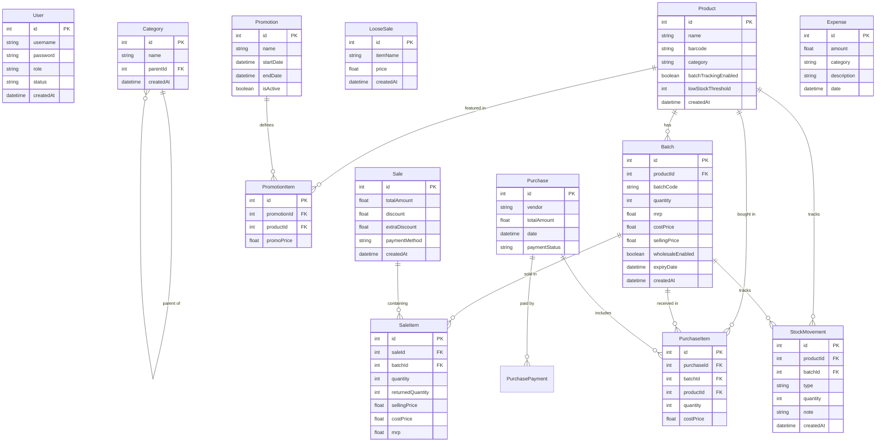

# POS Application Database ERD

This diagram visualizes the relationships between the different entities in your POS system.

## Key Modules Description

### 1. Inventory Core

- **Product**: The base definition of an item.
- **Batch**: Physical stock instances. This supports multiple batches for the same product (e.g., different expiry dates or purchase prices).

### 2. Sales & Transactions

- **Sale**: The header record for a transaction.
- **SaleItem**: Links a specific quantity of a **Batch** to a **Sale**.
- **LooseSale**: Simplified sales for items not in formal inventory.

### 3. Purchasing & Stock Control

- **Purchase**: Records of stock coming in from vendors.
- **StockMovement**: Audits every single stock change (Sale, Return, Adjustment).

### 4. Marketing & Misc

- **Promotion**: Temporary price overrides.
- **Expense**: Business costs (Rent, Electricity, etc.) not related to inventory.
- **Setting**: Application-level configurations.
